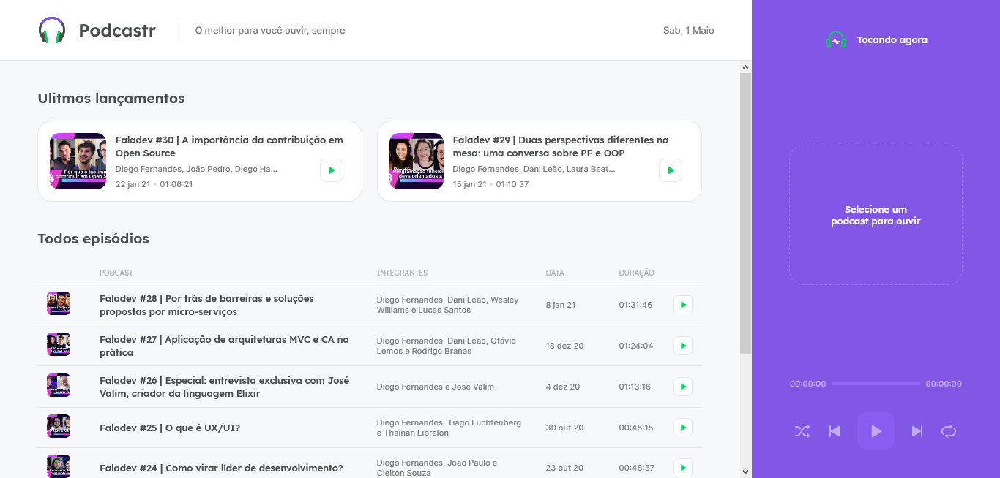
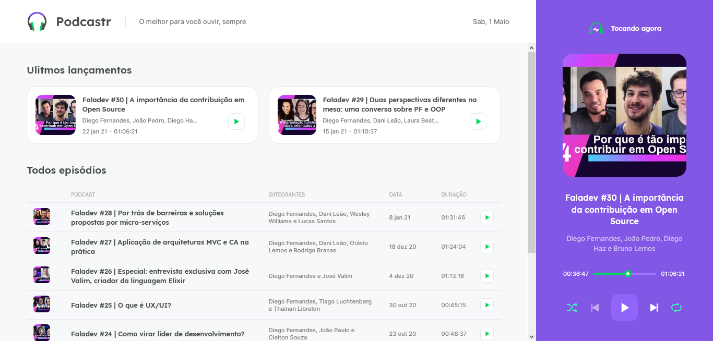
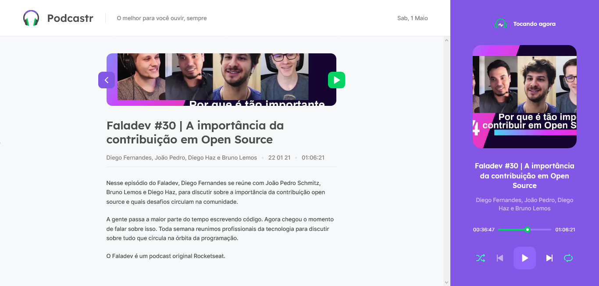

# [Podcastr - A podcast player website in Next/React](https://podcastr-et.vercel.app/)

## Overview

It's a website build in Next made in the [Next Level Week 5](https://nextlevelweek.com/) made by [Rocketseat](https://rocketseat.com.br/). The NLW5 is a project designed to provide a overview of the most used tecnologies in the development field (mobile and web). The event is separated in different paths with different tecnologies as React/Next, NodeJS, Flutter, React Native and Elixir. In this event I participated in the Next, Flutter and NodeJS.

I've being a part of 4 of this amazing events and every time I learn more and more. Awlways a new project with different themes and goals.



## Screenshot





### Links

- Live Site URL: [https://podcastr-et.vercel.app/](https://podcastr-et.vercel.app/)

- Next Level Week: [Link](https://nextlevelweek.com/)

- Rocketseat: [Link](https://rocketseat.com.br/)

## My process

### Built with

- [Next.js](https://nextjs.org/) - React framework
- [React](https://reactjs.org/) - JS library
- [Sass](https://sass-lang.com/)
- Semantic HTML5 markup
- CSS custom properties
- Flexbox

### What I learned

This is my third project using Next. The first was during the [NLW4](http://movit-et.vercel.app/), this was the first one to have Nextjs. The resulting project is on [Github](https://github.com/Erick-Oliveira-ET/NLW4/tree/main/frontend-next) as NLW4 and is [Live](https://movit-et.vercel.app/) (I use it dayly).

Programming using Next is beautiful: the hotreload is smooth, doesn't reload the entire page and is really fast what is great because the cold start of a project is the main reason of a programmers procrastination.

In this project I learn how to use a lot of Next's server side: as how to create static pages and dynamic static pages. It's a very interesting tool and I want to explore more of it in te future.

## Author

- Linkedin - [@erick-t-oliveira](https://www.linkedin.com/in/erick-t-oliveira/)
- Github - [Erick_Tomaz_ET](https://github.com/Erick-Oliveira-ET)
- Frontend Mentor - [@Erick-Oliveira-ET](https://www.frontendmentor.io/profile/Erick-Oliveira-ET)
- Instagram - [@erick_tomaz_kz](https://www.instagram.com/erick_tomaz_kz/)

## Acknowledgments

I have to thanks Arthur Bello ([ThurzinRB](https://github.com/ThurzinRB)) for showing me this challenge and suporting me in the process and Eliabe Vinicius ([eliabevces](https://github.com/eliabevces)) for being the code tester and point out my mistakes.

## Where to find everything

The task is to build out the project to the designs inside the `.github/images` folder. There`s both a mobile and a desktop version of the design.

There is also a `style-guide.md` file containing the information given to the project, such as color palette and fonts.

## Development

This is a [Next.js](https://nextjs.org/) project bootstrapped with [`create-next-app`](https://github.com/vercel/next.js/tree/canary/packages/create-next-app).

## Getting Started

First, run the development server:

```bash
npm run dev
# or
yarn dev
```
